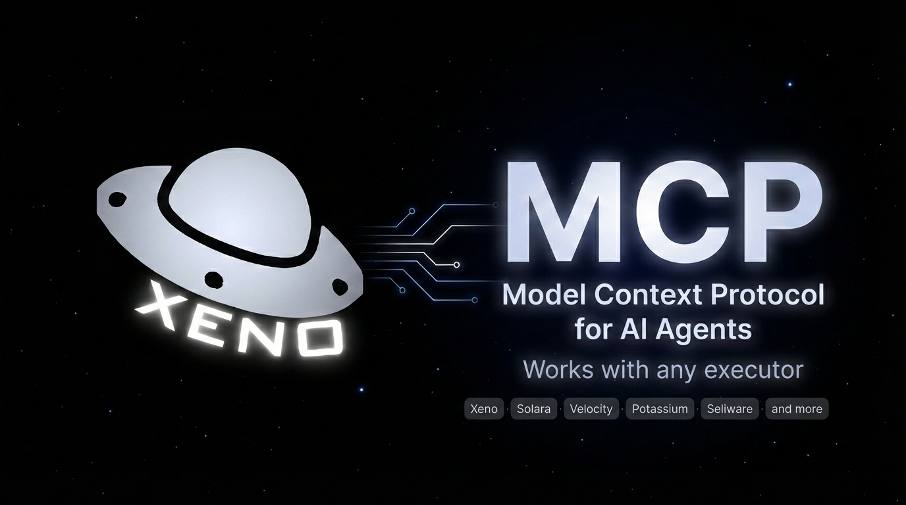

<p align="center">
  
</p>

# xeno-mcp

An MCP server that lets AI agents interact with Roblox game clients — execute Lua scripts, capture game output, search community scripts, and manage client connections — all from your favorite AI tool.

Supports two modes:
- **Xeno mode** — direct integration with the [Xeno](https://xeno.now) executor
- **Generic mode** — file-based adapter that works with **any** executor (Solara, Velocity, etc.)

> **What is Xeno?** — A free, keyless Roblox script executor with multi-attach support. Grab it at [xeno.now](https://xeno.now).

---

## Table of Contents

- [Architecture](#architecture)
- [Prerequisites](#prerequisites)
- [Build](#build)
- [Setup — Xeno Mode](#setup--xeno-mode)
- [Setup — Generic Mode](#setup--generic-mode)
- [MCP Configuration](#mcp-configuration)
- [Tools](#tools)
- [Logs & Pagination](#logs--pagination)
- [HTTP API](#http-api)
- [Server Flags](#server-flags)
- [Environment Variables](#environment-variables)
- [Testing](#testing)

---

## Architecture

Two components work together:

1. **HTTP Server** (Rust/actix-web, port 3111) — manages client state, receives logs from injected Lua scripts, proxies to executor APIs
2. **MCP Bridge** (TypeScript, stdio) — translates MCP tool calls into HTTP requests and auto-starts the server

**Xeno mode:**
```
AI Agent ←—stdio—→ MCP Bridge ←—http—→ HTTP Server ←—http—→ Xeno API ←→ Roblox
```

**Generic mode:**
```
AI Agent ←—stdio—→ MCP Bridge ←—http—→ HTTP Server ←—file—→ Exchange Dir ←—poll—→ Loader (in executor) ←→ Roblox
```

The bridge spawns the HTTP server automatically — you don't need to start it manually.

---

## Prerequisites

- **Windows** — Roblox executors are Windows-only
- [Rust](https://rustup.rs) — builds the HTTP server (`cargo`)
- [Node.js](https://nodejs.org) 18+ — runs the MCP bridge (`npm`)
- [Git](https://git-scm.com) — to clone the repo
- An executor: [Xeno](https://xeno.now) for Xeno mode, or any executor with UNC support for generic mode

---

## Build

```bash
git clone https://github.com/Lypt1x/xeno-mcp.git
cd xeno-mcp

# 1. Build the Rust HTTP server
cargo build --release

# 2. Build the MCP bridge
cd mcp-bridge
npm install
npm run build
cd ..
```

> First Rust build takes a few minutes (pulls dependencies). Subsequent builds are fast.

The server binary is at `target/release/xeno-mcp.exe`. The bridge output is at `mcp-bridge/dist/`.

---

## Setup — Xeno Mode

This is the default mode. Xeno has a built-in API that the server communicates with directly.

1. Build the project (see [Build](#build))
2. Add the MCP config to your AI agent (see [MCP Configuration](#mcp-configuration))
3. Open Xeno and inject into a Roblox client
4. Start your AI agent — the bridge starts the server automatically

That's it. The agent will detect Xeno clients and can execute scripts immediately.

---

## Setup — Generic Mode

Generic mode works with **any executor** that supports basic UNC functions. Instead of a direct API, scripts are exchanged through the filesystem.

### Requirements

Your executor must support:
- `readfile(path)` — read file contents
- `listfiles(path)` — list files in a directory
- `isfile(path)` — check if a path is a file
- `delfile(path)` — delete a file
- `request({...})` — make HTTP requests
- `getgenv()` — global environment table

### Setup

1. Build the project (see [Build](#build))
2. Find your executor's **workspace folder** (the directory where `readfile`/`writefile` operate)
3. Add the MCP config with generic mode env vars (see [MCP Configuration](#mcp-configuration))
4. Start your AI agent
5. Open your executor, inject into Roblox, and paste this into the executor:
   ```lua
   loadstring(game:HttpGet("http://localhost:3111/loader-script"))()
   ```
6. You'll see an in-game notification: **"Loader connected"** — you're ready to go

### What the loader does

The loader script runs inside the executor and:
- Polls `exchange/pending/` for new `.lua` script files every 200ms
- Executes scripts via `loadstring()` and deletes the file
- Captures all `print`/`warn`/`error` output and sends it to the server
- Sends heartbeats every 5 seconds to keep the connection alive
- **Auto-reconnects** if the server restarts (retries every 5s, notifies in-game)
- Automatically disconnects when the player leaves the game
- Prevents double-injection (safe to run multiple times)

### Autoexec (optional)

To skip pasting the loadstring every time you inject, save it to your executor's autoexec folder:

1. Find your executor's `autoexec` folder (usually inside the workspace/root directory)
2. Create a file called `xeno-mcp-loader.lua` with this content:
   ```lua
   loadstring(game:HttpGet("http://localhost:3111/loader-script"))()
   ```
3. The loader will now connect automatically every time you inject

---

## MCP Configuration

Add the following to your AI agent's MCP config. Replace the path with your actual clone location.

### Xeno Mode

<details>
<summary><b>Claude Desktop</b> — <code>%APPDATA%\Claude\claude_desktop_config.json</code></summary>

```json
{
  "mcpServers": {
    "xeno-mcp": {
      "command": "npx",
      "args": ["-y", "C:/path/to/xeno-mcp/mcp-bridge"]
    }
  }
}
```
</details>

<details>
<summary><b>VS Code / GitHub Copilot</b> — <code>.vscode/mcp.json</code></summary>

```json
{
  "mcp": {
    "servers": {
      "xeno-mcp": {
        "command": "npx",
        "args": ["-y", "C:/path/to/xeno-mcp/mcp-bridge"]
      }
    }
  }
}
```
</details>

<details>
<summary><b>Cursor</b> — <code>~/.cursor/mcp.json</code></summary>

```json
{
  "mcpServers": {
    "xeno-mcp": {
      "command": "npx",
      "args": ["-y", "C:/path/to/xeno-mcp/mcp-bridge"]
    }
  }
}
```
</details>

### Generic Mode

Add the `XENO_MCP_MODE` and `GENERIC_EXECUTOR_WORKSPACE` environment variables:

```json
{
  "mcpServers": {
    "xeno-mcp": {
      "command": "npx",
      "args": ["-y", "C:/path/to/xeno-mcp/mcp-bridge"],
      "env": {
        "XENO_MCP_MODE": "generic",
        "GENERIC_EXECUTOR_WORKSPACE": "C:\\path\\to\\executor\\Workspace"
      }
    }
  }
}
```

The bridge automatically creates the `exchange/pending/` and `exchange/done/` subdirectories inside the workspace.

### Optional: Shared Secret

To require authentication on all POST/DELETE endpoints:

```json
{
  "env": {
    "XENO_MCP_SECRET": "your-secret-here"
  }
}
```

---

## Tools

The MCP server exposes these tools to the AI agent:

### Core Tools

| Tool | Description |
|------|-------------|
| `get_health` | Server status, mode, executor connectivity, connected clients |
| `get_clients` | List connected Roblox clients (PID + username in Xeno, username in generic) |
| `execute_lua` | Run a Lua script on connected clients. Auto-selects if only one client is connected |
| `attach_logger` | Inject the log-forwarding script (Xeno mode only — generic mode includes it automatically) |
| `get_logs` | Query captured output with filters and pagination (see [Logs & Pagination](#logs--pagination)) |
| `clear_logs` | Wipe all stored logs |
| `get_loader_script` | Get the raw loader script source (generic mode, advanced use) |

### ScriptBlox Integration

| Tool | Description |
|------|-------------|
| `search_scripts` | Search community scripts on [ScriptBlox](https://scriptblox.com) by keyword |
| `browse_scripts` | Browse trending, popular, or recent scripts |
| `get_script_details` | Fetch full metadata, safety info, and raw source code for a script |
| `execute_scriptblox_script` | Fetch and execute a ScriptBlox script on connected clients |

The agent enforces safety rules: unverified scripts require explicit user confirmation, obfuscated scripts trigger warnings, and key systems are flagged.

---

## Logs & Pagination

Every script execution and all game output (`print`, `warn`, `error`) are captured as log entries.

### Log Levels

| Level | Source |
|-------|--------|
| `output` | `print()` calls from Roblox |
| `warn` | `warn()` calls from Roblox |
| `error` | `error()` calls and runtime errors |
| `info` | Internal events (loader attached, disconnected, etc.) |
| `script` | Every executed script is logged with this level |

### Pagination

Logs are returned **50 per page** by default (max 1000). The response includes:

```json
{
  "logs": [...],
  "total": 247,
  "page": 1,
  "per_page": 50,
  "total_pages": 5,
  "has_more": true
}
```

Use `page` (1-indexed) to navigate, or `offset` for manual control.

### Filters

All filters can be combined:

| Parameter | Description |
|-----------|-------------|
| `level` | Filter by level: `output`, `warn`, `error`, `info`, `script` |
| `search` | Substring search in messages (case-insensitive) |
| `source` | Filter by source (substring match) |
| `pid` | Filter by client PID |
| `tag` | Filter by tags (comma-separated) |
| `after` | Only logs after this ISO 8601 timestamp |
| `before` | Only logs before this ISO 8601 timestamp |
| `order` | Sort: `desc` (newest first, default) or `asc` (oldest first) |
| `page` | Page number (1-indexed) |
| `limit` | Results per page (default: 50, max: 1000) |
| `offset` | Manual offset (alternative to `page`) |

---

## HTTP API

For direct integration without MCP:

| Method | Endpoint | Description |
|--------|----------|-------------|
| `GET` | `/health` | Server status + mode + connected clients |
| `GET` | `/clients` | List Roblox clients |
| `POST` | `/execute` | Execute Lua: `{ "script": "...", "pids": ["123"] }` |
| `POST` | `/attach-logger` | Attach log script: `{ "pids": ["123"] }` |
| `GET` | `/loader-script` | Get the generic loader Lua script |
| `POST` | `/internal` | Client → server event channel (used by injected scripts) |
| `GET` | `/logs` | Query logs with filters (see [Logs & Pagination](#logs--pagination)) |
| `DELETE` | `/logs` | Clear all logs |

All POST/DELETE endpoints require the `X-Xeno-Secret` header when `--secret` is set.

---

## Server Flags

```
xeno-mcp [OPTIONS]

Options:
  -p, --port <PORT>                  Port to listen on [default: 3111]
  -b, --bind <ADDR>                  Bind address [default: 127.0.0.1]
      --console                      Print incoming logs to stdout
      --log-file <PATH>              Append logs to a file
      --secret <SECRET>              Require X-Xeno-Secret header on POST/DELETE
      --max-entries <N>              Max log entries in memory [default: 10000]
      --xeno-url <URL>               Xeno API URL [default: http://localhost:3110]
      --mode <MODE>                  Server mode: xeno or generic [default: xeno]
      --exchange-dir <DIR>           OS path for script exchange files [default: ./exchange]
      --executor-exchange-dir <DIR>  Exchange path as seen by the executor's filesystem
```

To run the server manually (useful for debugging):
```bash
./target/release/xeno-mcp --mode generic --exchange-dir "C:\Executor\Workspace\exchange" --executor-exchange-dir exchange --console
```

---

## Environment Variables

Configure the MCP bridge via environment variables in your MCP config:

| Variable | Default | Description |
|----------|---------|-------------|
| `XENO_MCP_URL` | `http://localhost:3111` | HTTP server URL |
| `XENO_MCP_SECRET` | — | Shared secret for authentication |
| `XENO_MCP_MODE` | `xeno` | Server mode: `xeno` or `generic` |
| `GENERIC_EXECUTOR_WORKSPACE` | — | Executor's workspace folder (generic mode only) |

Advanced overrides (rarely needed):

| Variable | Description |
|----------|-------------|
| `GENERIC_EXECUTOR_EXCHANGE_DIR` | Override the OS exchange directory path |
| `GENERIC_EXECUTOR_RELATIVE_DIR` | Override the executor-relative exchange path |

---

## Testing

Use the MCP Inspector to test tools interactively:

```bash
npx @modelcontextprotocol/inspector npx -y ./mcp-bridge
```

This opens a web UI where you can invoke each tool, inspect responses, and read resources.
